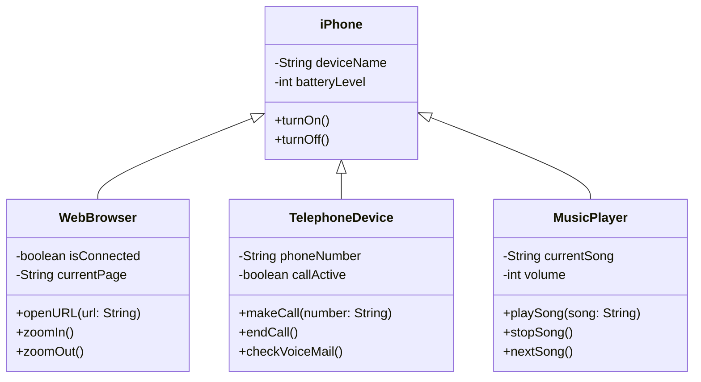

# iPhone 2007 UML Implementation in Java

## Overview
This project is a Java implementation of a UML class diagram inspired by the 2007 iPhone release presentation by Steve Jobs. The iPhone is modeled as a device combining three core features: a web browser, a telephone, and a music player. This was created as part of a learning exercise to practice UML design and Java programming.

## Features
- **iPhone**: The main class that integrates all features.
- **WebBrowser**: Simulates browsing with URL opening and zooming (inspired by Safari).
- **TelephoneDevice**: Handles calls and voicemail (reflecting the 2007 phone demo).
- **MusicPlayer**: Plays and navigates songs (mimicking the iPod functionality).

## UML Diagram



## How to Run
1. Clone this repository:
   ```bash
	https://github.com/cavalcantedouglas/desafio-uml.git
   ```

2. Enter the folder
   ```bash
   cd desafio-uml
   ```

3. Compile and run:
   ```bash
   javac *.java
   java Main
   ```
## Files
- `iPhone.java`: Main class with composition.
- `WebBrowser.java`: Browsing features.
- `TelephoneDevice.java`: Phone functionality.
- `MusicPlayer.java`: Music controls.
- `Main.java`: Demo program.

## Inpiration
Based on Steve Jobs’ 2007 iPhone keynote, highlighting “a phone, an iPod, and an internet device.”

## Author
- [Douglas Cavalcante](https://github.com/cavalcantedouglas) (Java and UML practice)
